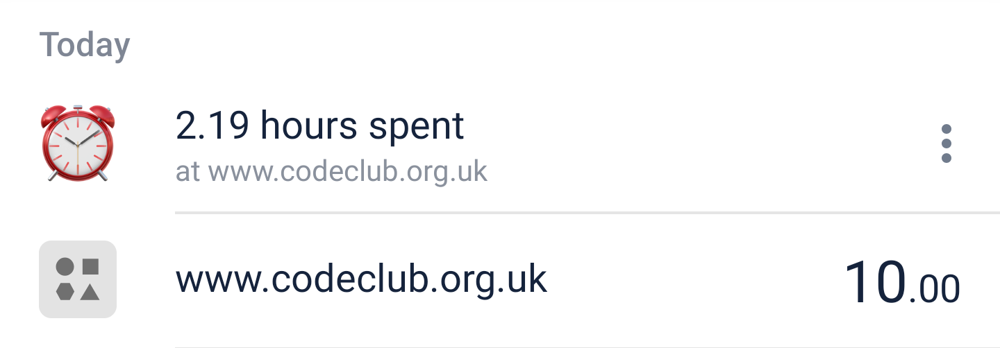

**time-is-money** translates your expenditures into time-spent (at work) to cover the cost, and shows that information as a card in your Monzo feed.



# Getting started

## Set up app

- Log into the [Monzo developer dashboard](https://developers.monzo.com)
- Register an Oauth application
- Build & spin up time-is-money:

```bash
go get .
go build .
MONZO_CLIENT_ID=abc123 MONZO_CLIENT_SECRET=123abc PUBLIC_BASE_URL="http://localhost:8000" MONTHLY_INCOME=1234 MONTHLY_OUTGOINGS=123 time-is-money
```

- Visit `/login` to get everything up & running
- Spend monaaaay

## Configuration

| Environmental variables | Description                                                                                                 | Default                                                                                                   |
| ----------------------- | ----------------------------------------------------------------------------------------------------------- | --------------------------------------------------------------------------------------------------------- |
| `MONZO_CLIENT_ID`       | OAuth Client ID to talk to the Monzo API                                                                    |                                                                                                           |
| `MONZO_CLIENT_SECRET`   | OAuth Secret Key to authenticate to the Monzo API                                                           |                                                                                                           |
| `PUBLIC_BASE_URL`       | The base URL (excluding final `/`) to access time-is-money from the world wide web, used for authentication |                                                                                                           |
| `MONTHLY_INCOME`        | Your income over a given month                                                                              |                                                                                                           |
| `MONTHLY_OUTGOINGS`     | Any fixed outgoings to deduct from your income, before calculating an effective hourly rate                 |                                                                                                           |
| `MONTHLY_WORKING_HOURS` | How many hours do you work per month                                                                        | 150 (37.5 hour weeks)                                                                                     |
| `FEED_URL`              | The URL you're sent when the Monzo feed item is clicked                                                     | https://github.com/RJacksonm1/time-is-money                                                               |
| `FEED_IMAGE_URL`        | The icon shown alongside the Monzo feed item                                                                |  |
| `PORT`                  | The port to listen for HTTP requests                                                                        | 8000                                                                                                      |
| `DATA_DIR`              | Directory to store persistant data(sqlite database)                                                         | `./` (local); `/var/lib/time-is-money` (docker)                                                           |
